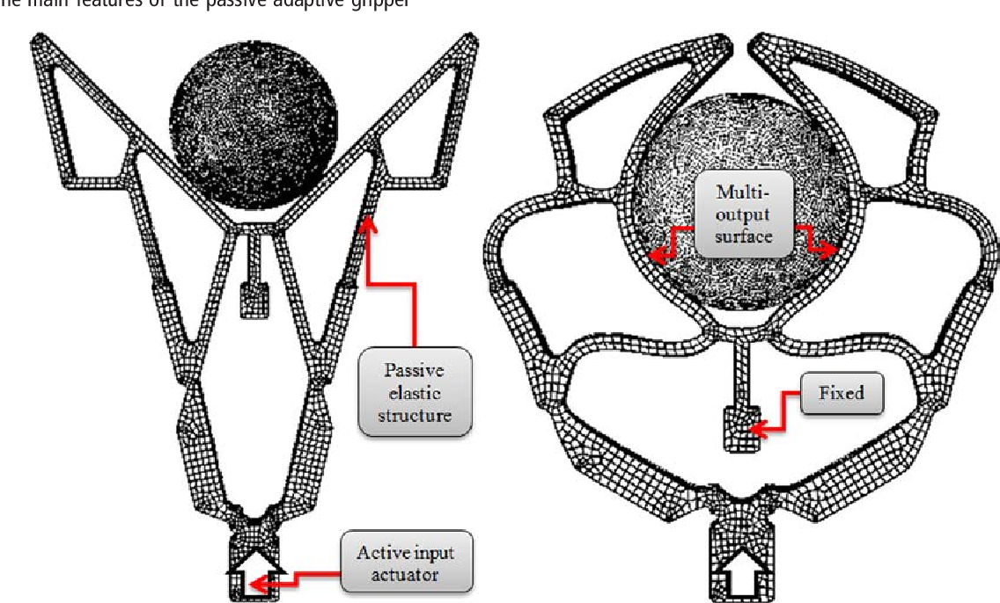
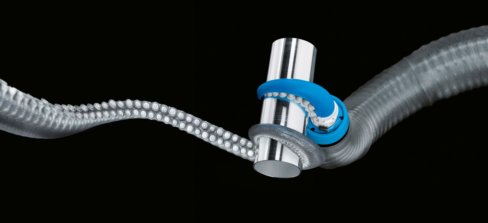
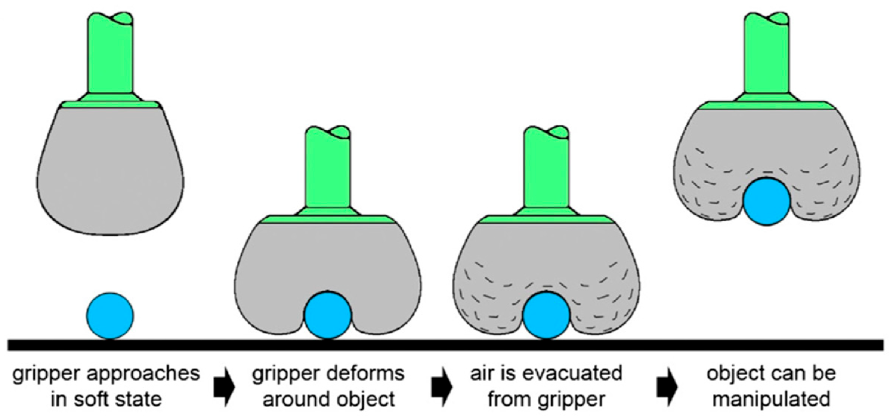
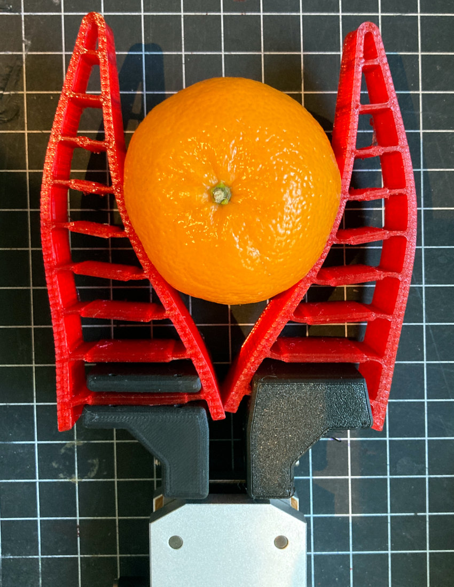
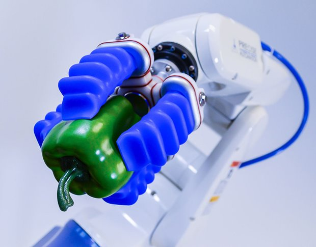
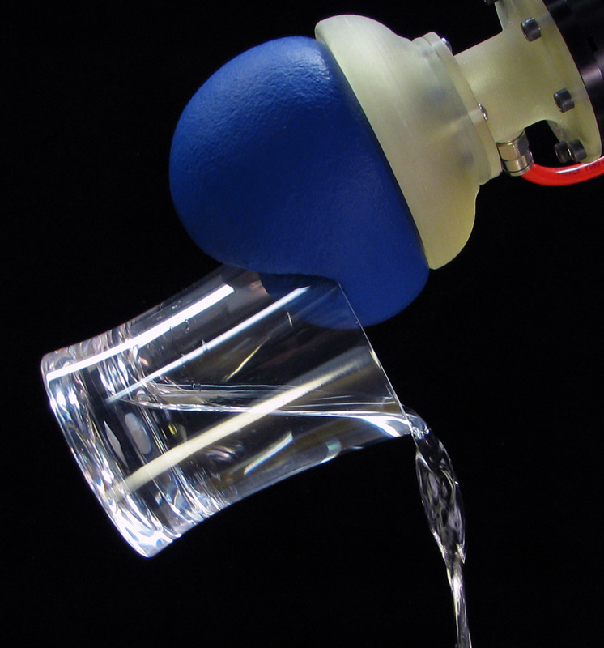
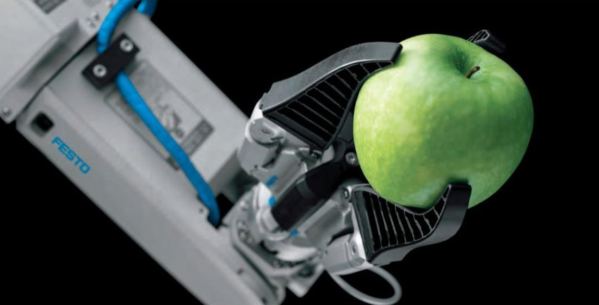
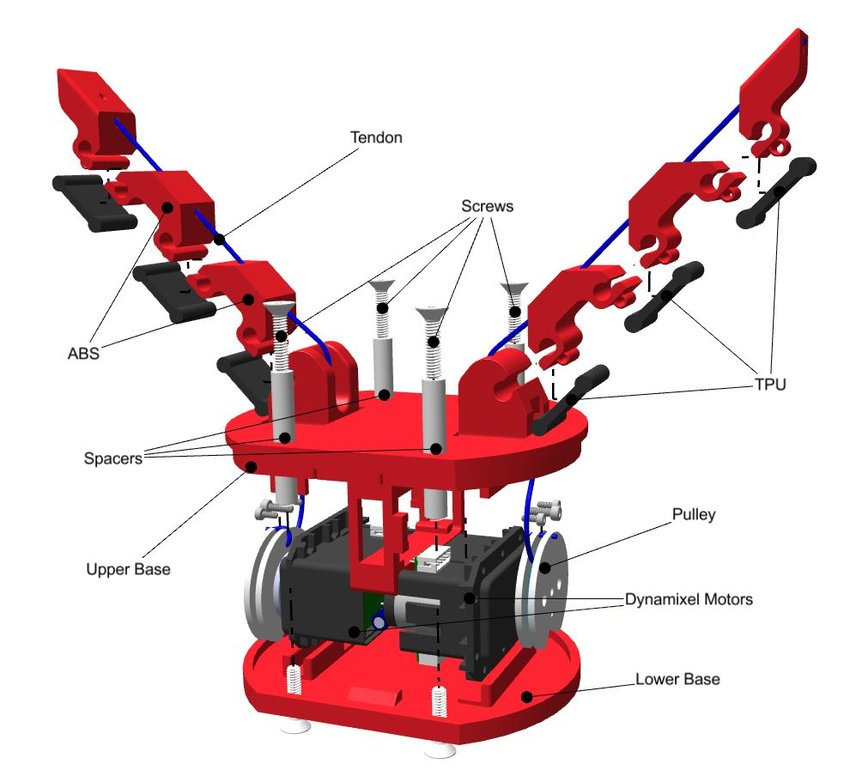
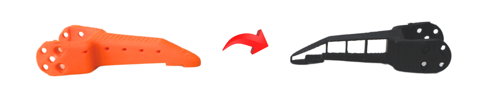
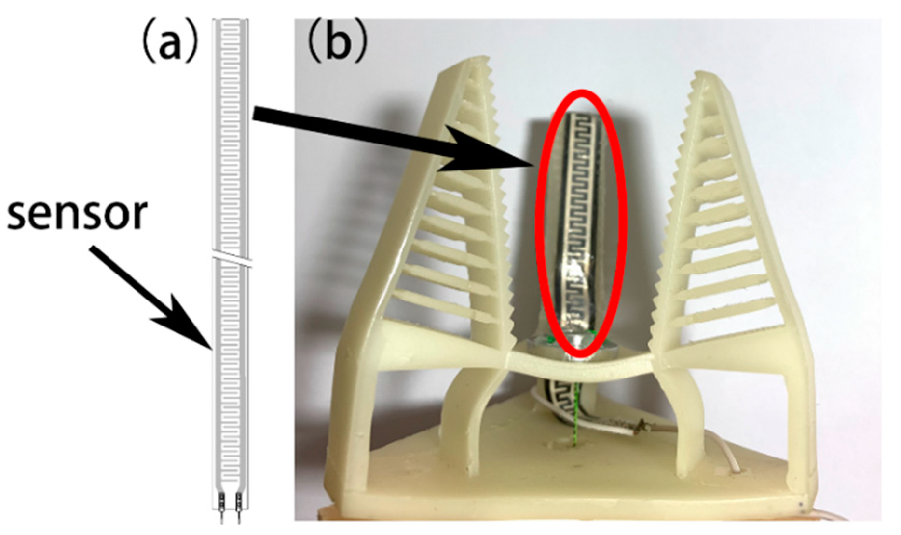

# 1. Introduction à la robotique souple

Là où la robotique industrielle classique cherche la plus haute précision possible et la force brute, la robotique souple (*soft robotics* ou *compliance robotics*) change de paradigme. Au lieu d'exiger que l'objet soit parfaitement positionné ou résistant, c'est le robot qui se déforme et s'adapte naturellement à la géométrie de l'objet. 

Cette "compliance" (capacité à se conformer) permet de manipuler des objets fragiles, asymétriques ou de formes aléatoires sans les endommager, là où une pince métallique classique échouerait.

    
  <em>Figure 1: Exemple de compliant gripper, ou prehenseur souple</em>

---

## 1.1 Contexte et inspirations

L'idée de concevoir des préhenseurs déformables s'inspire directement du biomimétisme (trompes d'éléphants, tentacules, **doigts humains**). Trois grandes étapes ont marqué le domaine :

* **Fin des années 70 :** Création du *Soft Gripper* par le Pr. Shigeo Hirose. Bien qu'en métal, ses doigts articulés par des câbles (façon tendon) s'enroulaient déjà autour des objets.
* **Fin des années 90 :** Exploitation de l'effet *Fin Ray*, inspiré des nageoires de poisson. Poussée contre un objet, la structure se plie *vers* lui pour l'envelopper, au lieu de s'en écarter.
* **Années 2010 :** L'explosion du domaine avec le *Granular Jamming* (un ballon rempli de particules qui se fige lorsqu'on y fait le vide) et les réseaux pneumatiques en silicone (qui se courbent sous la pression de l'air).

  
  &nbsp; &nbsp; &nbsp;
  
  &nbsp; &nbsp; &nbsp;
    
  <em>Figure 2: TentacleGripper par FESTO. Figure 3 : "Jamming" Grippers. Figure 4 : Exemple de Gripper utilisant l'effet FinRay.</em>

---

## 1.2 Les grandes familles de préhenseurs souples

Aujourd'hui, on classe généralement ces préhenseurs selon leur mode d'actionnement. Dans le cadre de ce stage, voici les technologies principales :

### A. Les préhenseurs pneumatiques (ou à fluides)
Souvent fabriqués par moulage de silicone ou impression 3D (TPU). On injecte de l'air dans des cavités internes asymétriques, ce qui force le doigt à se courber.
* **Avantage :** Déformation très douce et grande adaptabilité.
* **Inconvénient :** Nécessite des pompes, tuyaux et électrovannes (encombrant).

    
  <em>Figure 5: Prehenseur pneumatique</em>

### B. Le blocage granulaire (Granular Jamming)
Une membrane souple remplie de grains (sable, billes). On la pose sur l'objet et on aspire l'air : les grains se bloquent entre eux et la membrane épouse parfaitement la forme.
* **Avantage :** Saisit des géométries très complexes sans nécessiter de doigts.
* **Inconvénient :** Inefficace sur les objets trop mous qui s'écraseraient sous la membrane.

    
  <em>Figure 6: Prehenseur à blocage granulaire</em>

### C. Les mécanismes compliants (Effet Fin Ray)
Des structures géométriques flexibles (souvent imprimées en 3D en forme de "V" avec des traverses). Elles s'effondrent sur elles-mêmes pour saisir l'objet sous l'effet d'une simple pression mécanique.
* **Avantage :** Ne nécessite qu'un simple moteur électrique (idéal pour un bras robotique compact).
* **Inconvénient :** La préhension dépend de l'angle d'approche.

    
  <em>Figure 7: Prehenseur à effet raie à nageoires</em>

### D. Les préhenseurs à tendons
Un squelette souple traversé par des câbles internes. Un servomoteur tire sur ces câbles pour refermer les doigts, imitant le fonctionnement d'une main humaine.
* **Avantage :** Actionnement électrique facile à intégrer avec des pièces imprimées en 3D.

    
  <em>Figure 8: Prehenseur à tendons</em>

## 2. Analyse de la solution existante

Avant de concevoir notre propre préhenseur, il est essentiel d'analyser la solution déjà proposée par les créateurs du robot SO-ARM101. Actuellement, le bras dispose d'une version *Compliant Gripper* très basique (voir Figure 3). 

    
  <em>Figure 9: Le préhenseur souple d'origine du SO-ARM101, avec ses cavités internes.</em>

Il s'agit de ce qu'on appelle une **compliance "naïve"** : le modèle 3D du doigt rigide d'origine a simplement été évidé, puis imprimé avec un filament flexible (TPU). Si cette approche est rapide à mettre en œuvre, elle présente un défaut mécanique majeur. Lorsqu'il force sur un objet, le doigt a tendance à s'écraser sur lui-même ou à se tordre sur le côté (flambement) au lieu de s'enrouler proprement autour de la cible. La préhension manque donc de stabilité.

---

## 3. Objectifs d'amélioration et application au contexte médical

Pour répondre aux exigences de délicatesse et de fiabilité, nous proposons quatre axes d'amélioration pour le nouveau préhenseur :

### A. Intégration de la géométrie "Fin Ray"
Plutôt qu'un simple doigt évidé, la CAO intégrera une structure interne en forme de "V" avec des traverses obliques. Grâce à l'effet *Fin Ray*, lorsqu'une force est appliquée sur la face interne, le doigt se courbe naturellement **vers** l'objet pour l'envelopper fermement, garantissant une meilleure stabilité qu'un design naïf.

### B. Conception Hybride (Rigide / Souple)
Un préhenseur 100% en TPU est globalement trop mou, ce qui fait perdre en précision de positionnement spatial. Le nouveau design adoptera une approche bi-matière :
* **Une "colonne vertébrale" rigide** (imprimée en PLA ou PETG) reliée au servomoteur pour empêcher toute torsion latérale.
* **Une "pulpe" souple** (surface de contact en TPU) qui viendra s'emboîter sur la partie rigide. Cette modularité permettra de tester plusieurs duretés d'élastomères sans tout réimprimer.

### C. Intégration de capteurs de force (FSR)
En chirurgie, le retour d'effort est vital pour ne pas léser les tissus (comme la moelle épinière). Le nouveau design intègrera des logements spécifiques directement dans la pièce imprimée en TPU pour y insérer des capteurs FSR (*Force Sensitive Resistors*). Le système pourra ainsi mesurer la pression exercée et bloquer automatiquement la fermeture de la pince en cas d'effort excessif.

    
  <em>Figure 10: Exemple de prehenseur (b) avec un capteur de flexion (a).</em>

### D. Empreintes dédiées aux outils
Si le robot doit intéragir avec un outil ou un objet en particulier, ou pourra modeliser notre préhenseur souple avec la forme en negatif pour épouser la forme parfaitement.