# 1. Introduction à la robotique souple

Là où la robotique industrielle classique cherche la plus haute précision possible et la force brute, la robotique souple (*soft robotics* ou *compliance robotics*) change de paradigme. Au lieu d'exiger que l'objet soit parfaitement positionné ou résistant, c'est le robot qui se déforme et s'adapte naturellement à la géométrie de l'objet. 

Cette "compliance" (capacité à se conformer) permet de manipuler des objets fragiles, asymétriques ou de formes aléatoires sans les endommager, là où une pince métallique classique échouerait.

    
  <em>Figure 1 : Exemple de compliant gripper, ou préhenseur souple.</em>

---

## 1.1 Contexte et inspirations

L'idée de concevoir des préhenseurs déformables s'inspire directement du biomimétisme (trompes d'éléphants, tentacules, **doigts humains**). Trois grandes étapes ont marqué le domaine :

* **Fin des années 70 :** Création du *Soft Gripper* par le Pr. Shigeo Hirose. Bien qu'en métal, ses doigts articulés par des câbles (façon tendon) s'enroulaient déjà autour des objets.
* **Fin des années 90 :** Exploitation de l'effet *Fin Ray*, inspiré des nageoires de poisson. Poussée contre un objet, la structure se plie *vers* lui pour l'envelopper, au lieu de s'en écarter.
* **Années 2010 :** L'expansion du domaine avec le *Granular Jamming* (un ballon rempli de particules qui se fige lorsqu'on y fait le vide) et les réseaux pneumatiques en silicone (qui se courbent sous la pression de l'air).

  
  &nbsp; &nbsp; &nbsp;
  
  &nbsp; &nbsp; &nbsp;
    
  <em>Figure 2 : TentacleGripper par FESTO. Figure 3 : Préhenseurs à blocage granulaire. Figure 4 : Effet Fin Ray.</em>

---

## 1.2 Les grandes familles de préhenseurs souples

Aujourd'hui, on classe généralement ces préhenseurs selon leur mode d'actionnement. Dans le cadre de ce stage, voici les technologies principales :

### A. Les préhenseurs pneumatiques (ou à fluides)
Souvent fabriqués par moulage de silicone ou impression 3D (TPU). On injecte de l'air dans des cavités internes asymétriques, ce qui force le doigt à se courber.
* **Avantage :** Déformation très douce et grande adaptabilité.
* **Inconvénient :** Nécessite des pompes, tuyaux et électrovannes (encombrant).

### B. Le blocage granulaire (Granular Jamming)
Une membrane souple remplie de grains (sable, billes). On la pose sur l'objet et on aspire l'air : les grains se bloquent entre eux et la membrane épouse parfaitement la forme.
* **Avantage :** Saisit des géométries très complexes sans nécessiter de doigts.
* **Inconvénient :** Inefficace sur les objets trop mous qui s'écraseraient sous la membrane.

### C. Les mécanismes compliants (Effet Fin Ray)
Des structures géométriques flexibles (souvent imprimées en 3D en forme de "V" avec des traverses). Elles s'effondrent sur elles-mêmes pour saisir l'objet sous l'effet d'une simple pression mécanique.
* **Avantage :** Ne nécessite qu'un simple moteur électrique (idéal pour un bras robotique compact).
* **Inconvénient :** La préhension dépend de l'angle d'approche.

### D. Les préhenseurs à tendons
Un squelette souple traversé par des câbles internes. Un servomoteur tire sur ces câbles pour refermer les doigts, imitant le fonctionnement d'une main humaine.
* **Avantage :** Actionnement électrique facile à intégrer avec des pièces imprimées en 3D.

 

  
  &nbsp;
  
  &nbsp;
  
  &nbsp;
    
  <em>Figure 5 : De gauche à droite : Préhenseur pneumatique, à blocage granulaire, à effet Fin Ray, et à tendons.</em>

---

## 2. Analyse de la solution existante

Pour concevoir un préhenseur efficace, partons de la solution déjà proposée par les créateurs du robot SO-ARM101. Actuellement, le bras dispose d'une version *Compliant Gripper* très basique (voir Figure 6). Il existe aussi une solution de FRE proposée par "GauravMM" sur MakerWorld, qui s'adapte au SO-ARM-101, et qui possède 2 fin ou 2 "nageoire" par dent de la pince, soit 4 nageoires au total pour bien enlacer l'objet.

  
  &nbsp;
  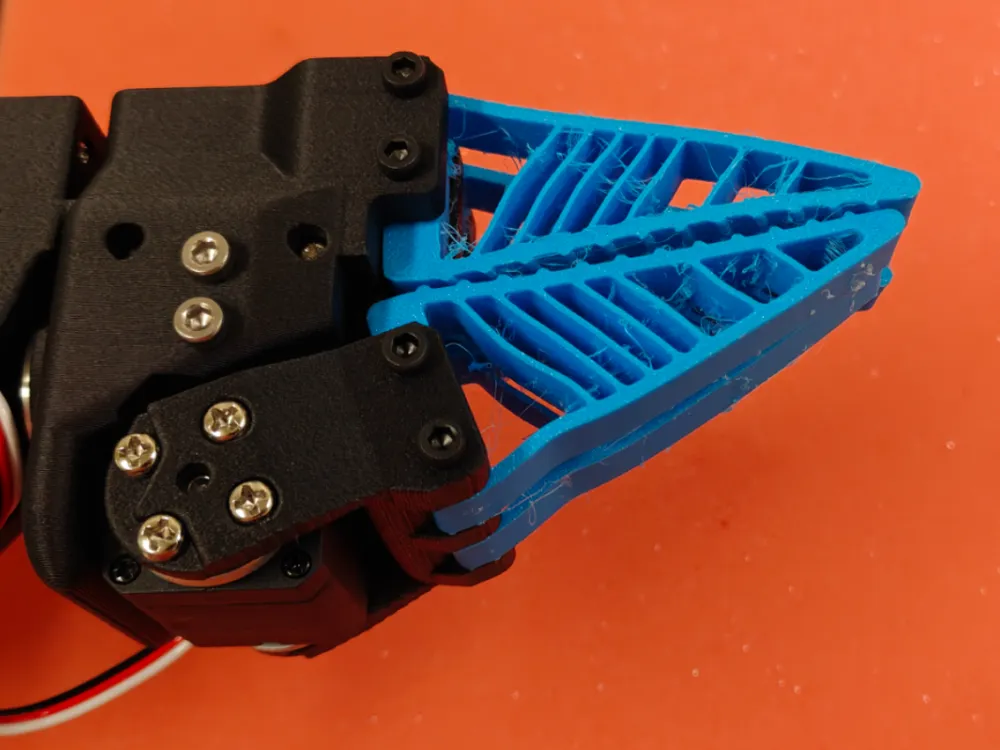  
  <em>Figure 6 : De gauche à droite : Préhenseur compliant basique SO-ARM101, Préhenseur à effet Fin Ray de "GauravMM" sur MakerWorld</em>

Il s'agit de ce qu'on appelle une **compliance "naïve"** : le modèle 3D du doigt rigide d'origine a simplement été évidé, puis imprimé avec un filament flexible (TPU). Si cette approche est rapide à mettre en œuvre, elle présente un défaut mécanique majeur. Lorsqu'il force sur un objet, le doigt a tendance à s'écraser sur lui-même ou à se tordre sur le côté (flambement) au lieu de s'enrouler proprement autour de la cible. La préhension manque donc de stabilité.

Le modèle de "GauravMM" est deja bien plus complexe est travaillé, selon ses mots : 

> *EN(OG): This uses the Fin-Ray effect for controlled buckling to allow gripping strangely shaped, thin, and brittle objects. Overall, it works much better than the standard gripper across a variety of shapes. Unlike most standard fin-ray grippers, we use slanted ribs and an angled bottom to control the direction of buckling*
>
>*FR :Il utilise l'effet Fin-Ray pour un flambage contrôlé afin de permettre la préhension d'objets de forme étrange, fins et fragiles. Globalement, il fonctionne bien mieux que le préhenseur standard pour une variété de formes. Contrairement à la plupart des préhenseurs Fin-Ray standard, nous utilisons des nervures inclinées et un fond angulaire pour contrôler la direction du flambage*
>> 
— <b>3d model description by "GauravMM" on MakerWorld</b>

---

## 3. Objectifs d'amélioration et champs d'application

L'un des grands atouts de la robotique souple est sa polyvalence. Le préhenseur développé durant ce stage a vocation à manipuler des objets de nature très différente, allant d'applications médicales (manipulation d'outils chirurgicaux ou de structures osseuses) à des tâches logistiques ou agricoles (saisie de fruits et légumes fragiles sans les meurtrir). 

Pour répondre à ces exigences de délicatesse, de fermeté et de fiabilité, mon travail de CAO s'articule autour de cinq grands axes d'amélioration :

### A. Intégration de la géométrie "Fin Ray"
Plutôt qu'un simple doigt évidé, la CAO intégrera une structure interne en forme de "V" avec des traverses obliques. Grâce à l'effet *Fin Ray*, lorsqu'une force est appliquée sur la face interne, le doigt se courbe naturellement **vers** l'objet pour l'envelopper fermement, garantissant une meilleure stabilité qu'un design naïf.

### B. Conception Hybride (Rigide / Souple)
Un préhenseur 100% en TPU est globalement trop mou, ce qui fait perdre en précision de positionnement spatial. Le nouveau design adoptera une approche bi-matière :
* **Une "colonne vertébrale" rigide** (imprimée en PLA ou PETG) reliée au servomoteur pour empêcher toute torsion latérale.
* **Une "pulpe" souple** (surface de contact en TPU ou silicone) qui viendra s'emboîter sur la partie rigide. Cette modularité permettra de tester plusieurs configurations sans tout réimprimer.

### C. Recherche sur le retour d'effort (Capteurs FSR)
En chirurgie, ou pour manipuler des objets délicats, le retour d'effort est précieux pour ne pas léser les tissus ou écraser l'objet. L'objectif initial était d'intégrer des capteurs FSR (*Force Sensitive Resistors*) directement dans la zone de contact. Cependant, comme détaillé dans la section suivante, cette intégration se heurte aux contraintes physiques de la compliance, imposant un positionnement géométrique très spécifique.

    
  <em>Figure 10 : Exemple de préhenseur souple (b) instrumenté avec un capteur de force (a).</em>

### D. Optimisation de l'encastrement ("Fixed Clamp")
Pour maximiser la capacité de charge du préhenseur sans augmenter la dureté des élastomères, la structure d'accueil en PLA ne sera pas une simple base plate. Elle intégrera une bride rigide enveloppant le dos extérieur du doigt, une méthode mécanique validée par la littérature récente pour optimiser le transfert d'énergie vers l'objet.

### E. Empreintes dédiées aux outils
Si le robot doit interagir avec un outil ou un objet spécifique, on pourra modéliser l'intérieur de la surface souple en "négatif" pour en épouser parfaitement les contours et verrouiller mécaniquement la prise.

---

## 4. Limites de l'intégration de capteurs embarqués

Bien que l'intégration de capteurs de force (FSR) représente une piste prometteuse pour obtenir un retour d'effort, cette approche n'est pas sans compromis. Le principe fondamental de la robotique souple repose sur la **déformation libre des matériaux** ; or, l'insertion de composants électroniques rigides vient souvent altérer cette propriété.

Ce paradoxe technologique est très bien documenté dans la littérature scientifique. Comme le soulignent les travaux récents sur les préhenseurs à effet Fin Ray (MDPI, *Actuators*, 2025) :

> 📖 **Extrait de la littérature**
>
> *"Sensing is critical for enabling soft robotic grippers to achieve intelligent, adaptive manipulation, particularly in unstructured environments. Traditional methods include embedding strain sensors, pressure sensors, and even optical fibers into soft actuators to capture deformation and contact information [4,7,9,20,31].*
>
> ***However, such embedded systems often introduce undesired stiffness, increase fabrication complexity, and limit the compliance that soft robots are designed to exploit [7,9].***
>
> *These limitations have spurred interest in non-contact or external sensing strategies, particularly vision-based and light-based approaches that allow the system to observe deformation and interaction without compromising softness."*
>
> 
— <b>Electro-Actuated Customizable Stacked Fin Ray Gripper for Adaptive Object Handling</b>

Dans le cadre du développement de notre effecteur pour le SO-ARM101, cette observation soulève un défi de conception majeur. Intégrer un capteur FSR (et son câblage) directement au cœur de la zone de contact risque d'introduire une rigidité locale non désirée (la *stiffness* mentionnée dans l'article), limitant ainsi la capacité du doigt à s'enrouler autour de l'objet manipulé. De plus, cela augmente considérablement la complexité de fabrication (passage des câbles à l'intérieur d'une pièce imprimée ou moulée).

Pour pallier ce problème tout en conservant le retour d'effort, le choix a été fait lors de la CAO de positionner ces capteurs de manière stratégique : ils seront placés **à l'interface mécanique exacte** entre l'endosquelette rigide en PLA et la structure déformable, afin que l'électronique s'interpose dans la chaîne de transmission des efforts sans jamais entraver la souplesse de la surface de contact.

---

## 5. Dimensionnement mécanique : Justification des épaisseurs (TPU vs Silicone)

Le design retenu pour ce projet se décline en deux configurations exploitant l'effet *Fin Ray* : une version classique à 2 doigts opposés, et une version à 4 doigts (deux de chaque côté) pour optimiser l'enveloppement et la stabilité de l'objet manipulé. Afin d'évaluer l'impact du matériau sur la préhension, ces architectures seront développées en parallèle selon deux procédés : une version imprimée en 3D (TPU 95A) et une version moulée (Silicone 20A).

  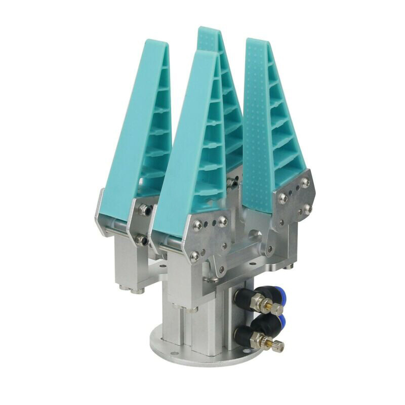  
  <em>Figure 11 : Préhenseur à effet Fin Ray (Exemple de la configuration à 4 doigts).</em>

Cependant, ces deux matériaux ayant des propriétés mécaniques diamétralement opposées, on ne peut pas utiliser le même fichier CAO pour les deux. Il est impératif d'adapter l'épaisseur des parois géométriques pour obtenir un comportement en flexion similaire.

### A. Choix empirique pour le TPU (0.8 mm)

Pour le modèle en TPU (Shore 95A), l'épaisseur des parois extérieures a été fixée à **0.8 mm**. 

Ce choix ne résulte pas d'un calcul théorique, mais d'une observation empirique de l'état de l'art et des projets *open-source* existants. Dans la pratique de l'impression 3D FDM avec une buse standard de 0.4 mm, une épaisseur de 0.8 mm correspond exactement à deux périmètres d'impression (deux murs). C'est le ratio optimal documenté par la communauté pour garantir à la fois l'étanchéité de la paroi, une bonne imprimabilité, et une flexibilité suffisante pour que le doigt se courbe sans forcer excessivement sur le servomoteur.

### B. Modélisation mathématique pour le Silicone (2 à 4 mm)

Le silicone de moulage possède un module de Young ($E$) beaucoup plus faible que le TPU. Pour éviter que le doigt en silicone ne s'effondre sur lui-même (flambement) sous son propre poids ou au moindre contact, il faut calculer la nouvelle épaisseur requise pour égaler la rigidité structurelle du modèle en TPU.

**1. Données d'entrée (Modules de Young moyens) :**
* $E_{TPU} \approx 25\text{ MPa}$
* $E_{Silicone} \approx 0.5\text{ MPa}$

**2. Théorie des poutres :**
Dans une structure *Fin Ray*, chaque paroi travaille en flexion. La rigidité en flexion d'une poutre est le produit de son module de Young ($E$) et de son moment quadratique ($I$). Pour une section rectangulaire de largeur $w$ et d'épaisseur $h$, le moment quadratique s'exprime ainsi :

$$I = \frac{w \cdot h^3}{12}$$

Pour que le doigt en silicone offre la même résistance à la flexion que celui en TPU, leurs rigidités doivent être strictement égales :

$$E_{TPU} \cdot I_{TPU} = E_{Silicone} \cdot I_{Silicone}$$

En remplaçant $I$ par sa formule et en simplifiant la largeur $w$ (qui reste constante entre les deux designs) et le diviseur 12, on obtient :

$$E_{TPU} \cdot h_{TPU}^3 = E_{Silicone} \cdot h_{Silicone}^3$$

L'objectif est d'isoler l'épaisseur du silicone ($h_{Silicone}$) :

$$h_{Silicone} = h_{TPU} \cdot \sqrt[3]{\frac{E_{TPU}}{E_{Silicone}}}$$

**3. Application numérique :**
Le rapport de rigidité entre nos deux matériaux est de 50 ($25 / 0.5$). En appliquant notre épaisseur de référence $h_{TPU} = 0.8\text{ mm}$, le calcul devient :

$$h_{Silicone} = 0.8 \cdot \sqrt[3]{50}$$
$$h_{Silicone} \approx 0.8 \cdot 3.684$$
$$h_{Silicone} \approx 2.94\text{ mm}$$

### C. Conclusion sur la CAO

Ce développement mathématique démontre que pour compenser la souplesse extrême du silicone, l'épaisseur de la paroi ne doit pas être proportionnelle à la différence de rigidité (x50), mais proportionnelle à sa racine cubique. 

Ainsi, une paroi en TPU de **0.8 mm** équivaut mécaniquement à une paroi en silicone d'environ **2.9 mm**. Ce résultat justifie scientifiquement notre décision de modéliser le moule du préhenseur en silicone avec des épaisseurs comprises entre **2 mm et 4 mm** selon les zones, garantissant ainsi un comportement *Fin Ray* fonctionnel et comparable à la version imprimée en 3D.

---

## 6. Optimisation structurelle : Le concept de "Fixed Clamp"

Bien que la géométrie asymétrique améliore la cinématique du préhenseur, les structures *Fin Ray* imprimées en matériaux souples souffrent souvent d'un manque de rigidité latérale à leur base, ce qui limite la force de préhension et la capacité de charge (charge utile). 

Une étude très récente (*Modeling and modification of fin-ray effect grippers*, Sheikhsofla et al., 2025) a démontré qu'une modification des conditions d'encastrement à la base du doigt permettait de pallier ce problème. L'ajout d'une bride de fixation rigide (*Fixed Clamp*) remontant le long de la face externe du doigt empêche la base de s'écraser vers l'extérieur. L'énergie mécanique est ainsi intégralement redirigée vers la face interne, forçant le doigt à s'enrouler autour de l'objet. 

Selon leurs résultats, **ce nouveau design d'adaptateur améliore la capacité de charge de 150 %**.

  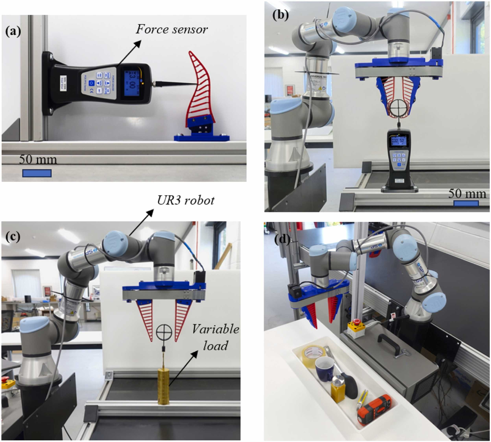
  &nbsp; &nbsp;
  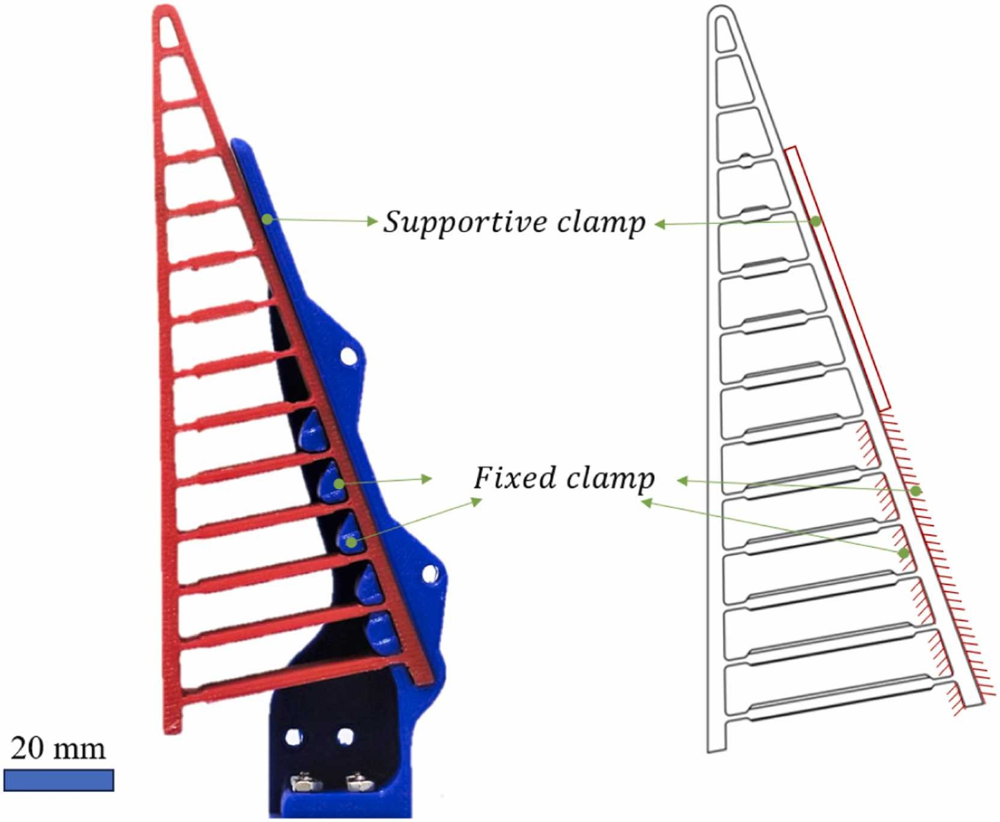
  &nbsp; &nbsp;
  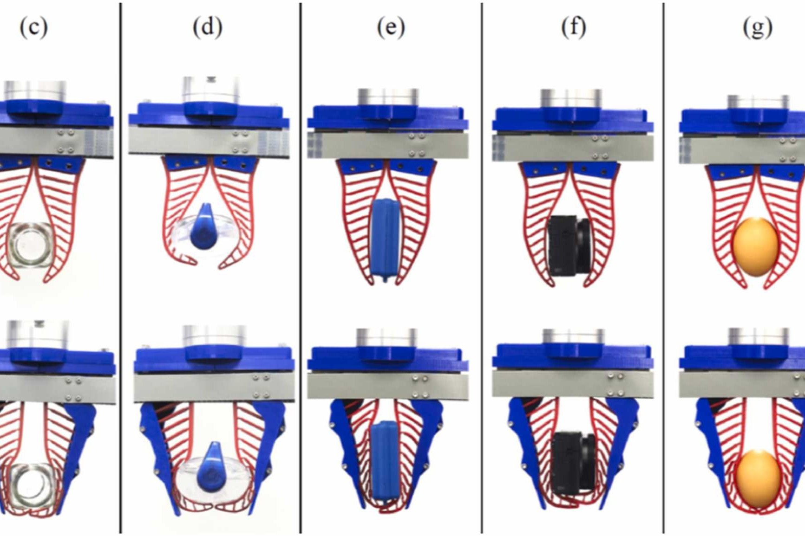  
  <em>Figure 12 : Préhenseur avec nageoire "pincée" (fixed clamp) tiré de l'étude citée ci-dessus.</em>

Cette optimisation est particulièrement pertinente pour notre usage, car elle permet au robot de soulever des objets plus lourds (comme des fruits denses ou des outils chirurgicaux en métal) tout en conservant une pression douce au bout des doigts.

---

## 7. Modélisation CAO de la Version 1 (V1)

Fort de cette analyse théorique, le préhenseur d'origine du bras SO-ARM101 a été entièrement repensé sous Fusion 360. 

La compliance "naïve" d'origine a été remplacée par un effecteur exploitant l'effet *Fin Ray*, monté sur une interface rigide agissant comme un *Fixed Clamp*. Ce système bi-matière permet de stabiliser les doigts lors de la prise de force, tout en laissant les extrémités libres de s'enrouler autour de leur cible. 

### A. Comparaison avec la solution d'origine
Les captures ci-dessous mettent en évidence le saut technologique entre la version initiale évidée du SO-ARM101 et le nouveau design développé intégrant les traverses obliques et la bride de fixation :

  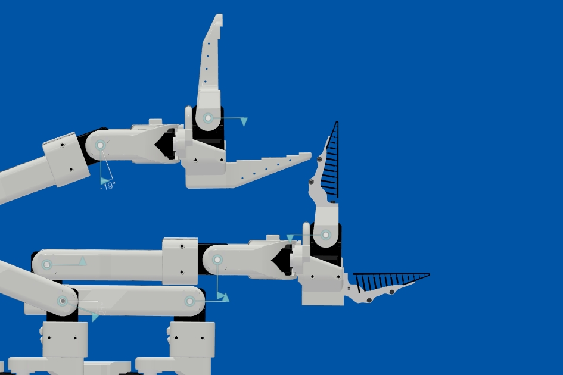
  &nbsp; &nbsp;
  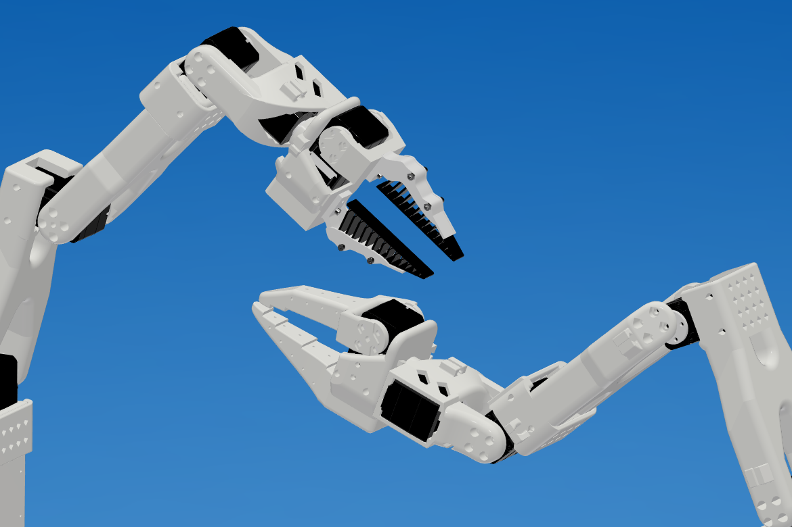
  &nbsp; &nbsp;
  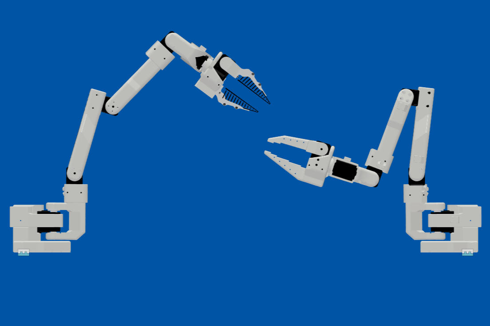  
  <em>Figure 13 : Comparaison visuelle et structurelle entre le gripper d'origine et la nouvelle version optimisée (Screenshot de Fusion 360).</em>

### B. Alignement avec l'état de l'art
Afin de valider la conformité géométrique de notre modèle, une comparaison directe a été effectuée entre notre modèle CAO et le modèle théorique validé par l'étude de Sheikhsofla et al. (2025) :

  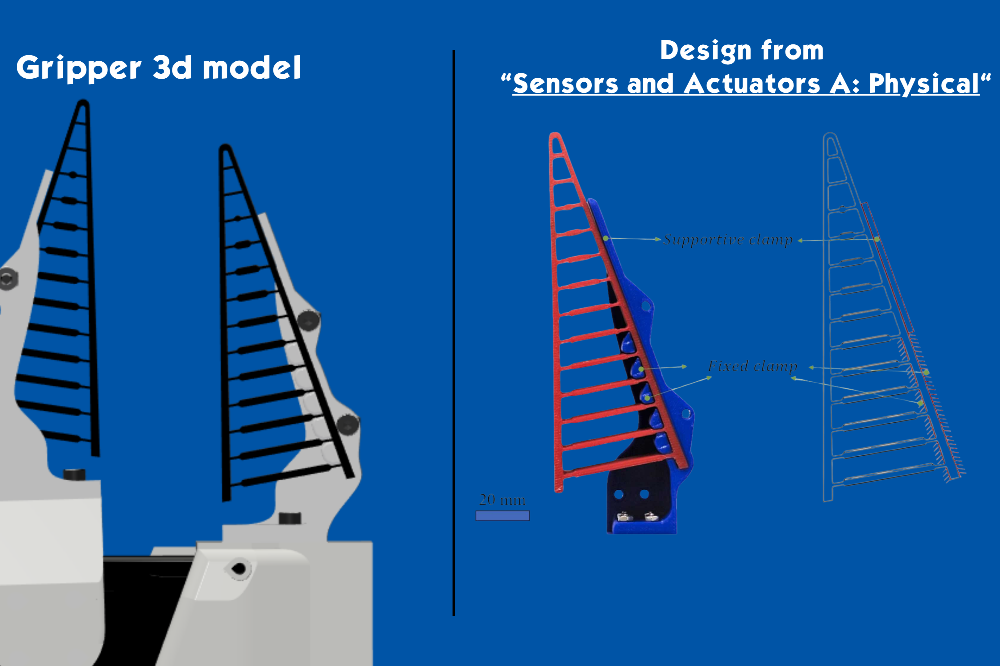  
  <em>Figure 14 : Confrontation de notre design CAO face au modèle de référence à bride fixe (Fixed Clamp) de la littérature. (Screenshot de Fusion 360)</em>

### C. Rendu de l'assemblage complet
Voici le rendu final de l'assemblage complet de cette première version (V1) fonctionnelle, intégrée directement à la cinématique globale et aux actionneurs du bras robotique :

  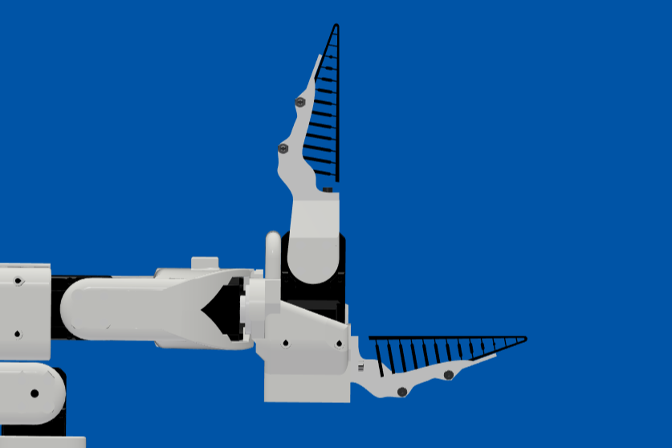
  &nbsp; &nbsp;
  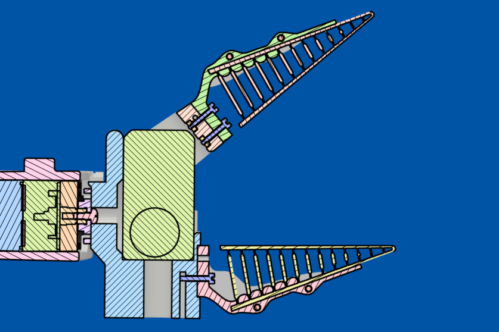
  &nbsp; &nbsp;
  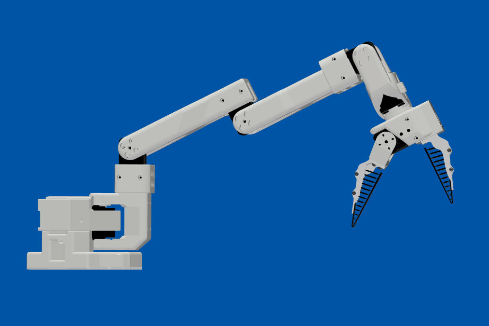  
  <em>Figure 15 : Intégration CAO finale de la V1 du préhenseur souple sur le bras SO-ARM101. (Screenshot de Fusion 360)</em>

---

## 8. Bibliographie et Références

* **Sheikhsofla, M. et al. (2025).** *Modeling and modification of fin-ray effect grippers to improve their load capacity and grasp stability*. Sensors and Actuators A: Physical. Consulté sur : [ScienceDirect](https://www.sciencedirect.com/science/article/pii/S0924424725005175)
* **Neu, J. et al. (2025).** *Electro-Actuated Customizable Stacked Fin Ray Gripper for Adaptive Object Handling*. Actuators, MDPI. Consulté sur : [MDPI](https://www.mdpi.com/2076-0825/15/1/52#B4-actuators-15-00052)
* **Springer (2024).** *Étude sur les mécanismes compliants et les préhenseurs souples en robotique*. Consulté sur : [Springer Link](https://link.springer.com/article/10.1007/s40430-024-04957-0/figures/11)
* **GauravMM(2025).** *Fin Ray Effect Gripper for SO-ARM-101 Robot Arm*. Consulté sur : [MakerWorld](https://makerworld.com/fr/models/2075813-so101-robot-arm-fin-ray-gripper#profileId-2242454)